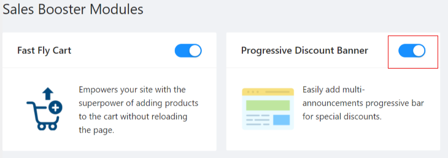
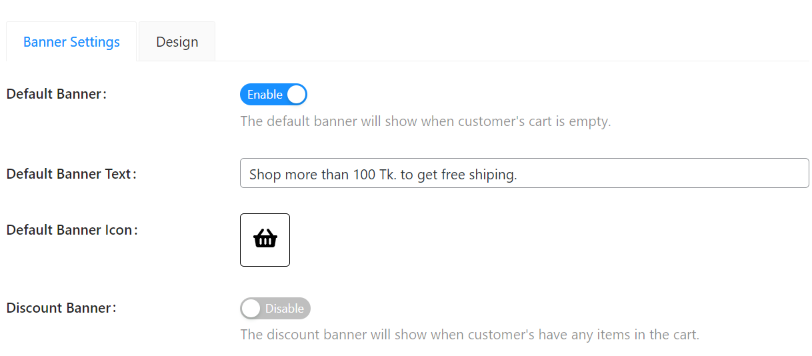
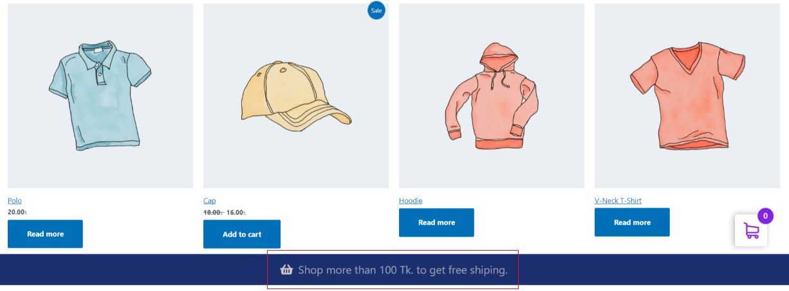
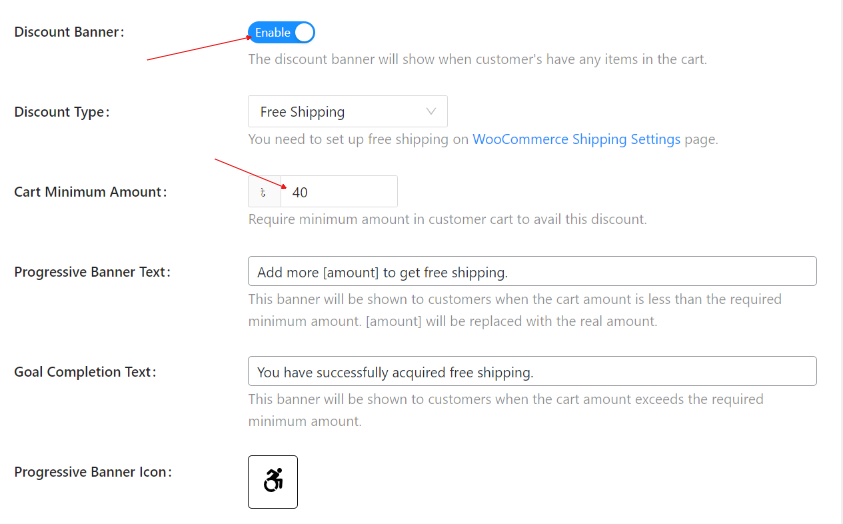
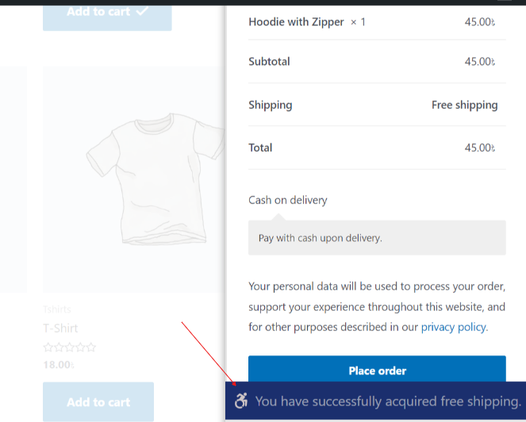
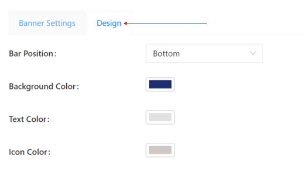

# Discount Banner Module.
This is the third module of sales booster plugin. Discount banner based on certain condition will be shown on shop page, if this module is remain acitve.

## How to active Discount Banner?
Install sales booster plugin and activate Discount Banner module as following figure:

**Banner Settings:**
Enable default banner option, if you want to show default discount banner when the customer's cart is empty. Type banner text and choose cart icon as you want to see in discount banner.

The front-end view of the setting will be like below:

The next discount banner will be shown when the customer's have any item in the cart. You can change discount type, cart minimum amount and other options as needed from the banner settings as shown below.

The front-end view of the above settings will be similar as following figure:

**Design:**
The design setting is used to select discount bar position (either top or bottom), the background color, text color and icon color of the bar as given below.

We are ready to here from you for any queries salesbooster@gmail.com for any further help.
