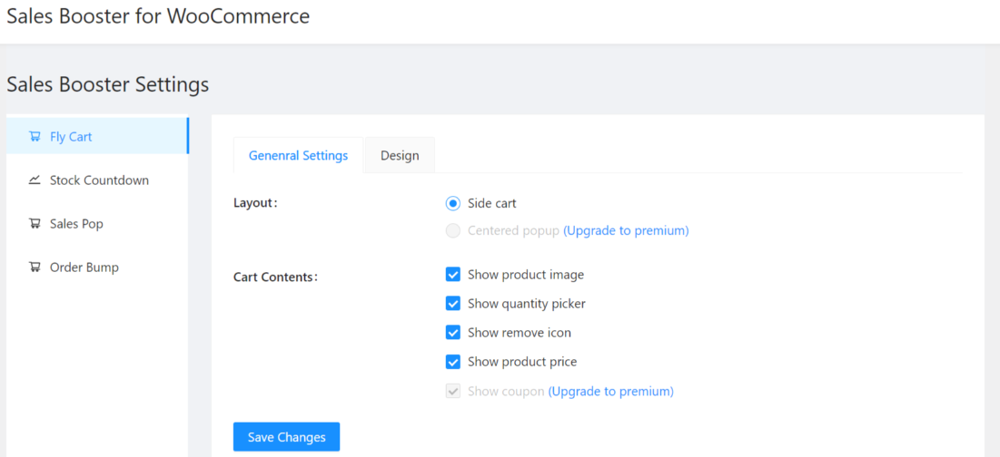
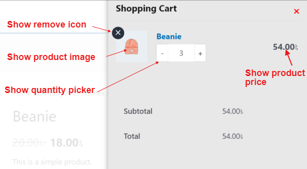
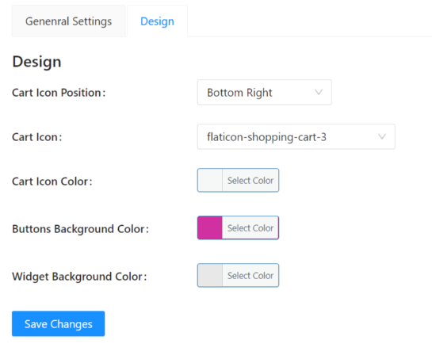
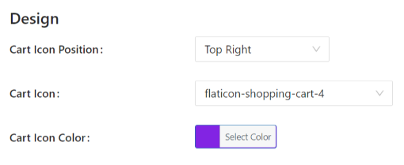
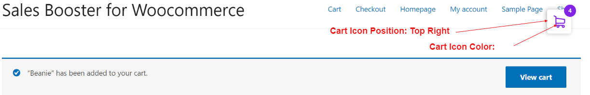
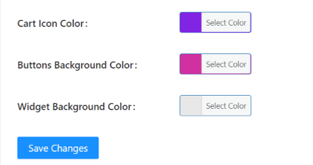
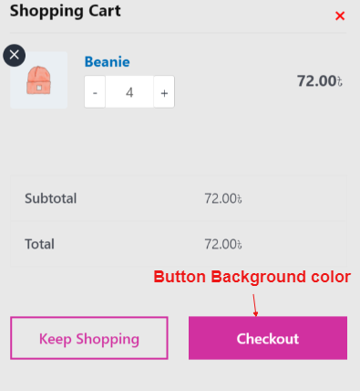

# Fly Cart Module.
This is the first module of sales booster plugin. It will provide flying flavor when a item move to cart.

## How to active Fly Cart?
First, install wocommerce plugin then install sales booster plugin and activate Fly Cart module. Upon activation, view settings will be shown. There are have two types of setting namely (i) General Settings and (ii) Design.

- 
 General Settings: In general settings you can check or uncheck cart content options i.e. product image, quantity picker, remove icon and product price optoins as followinng figure.

**General Settings:**

Check or uncheck the checkboxes to active or deactive the option. For example, if you check all the checkboxes under Cart Content, the corresponding changes in your site will be as shown in the following figure.

- Design: Five different design settings are present in this view as described below:
  - Cart Icon Position: You can change the position where cart icon will be showned.
  - Cart Icon: Any one icon can be chosen from 7 icons as cart icon.
  - Cart Icon Color: Any color can be chosen as cart icon color from color palet or typing hash color code in text box.
  - Button Background Color: This option is used to set button background color.
  - Widget Background Color: Cart background color easily can be changed using this setting optio
  
  

  For example, if you change the design options as below:
  
  
  In your site you can see the cart icon position at the top-right corner and cart-icon-color is changed as well like following figure:
  

  If you change button and widget background color under Design option:
  

  The outcome will be as below in the shopping cart:

  

Please feel free to contact us at salesbooster@gmail.com for any further help.
