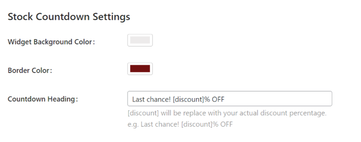
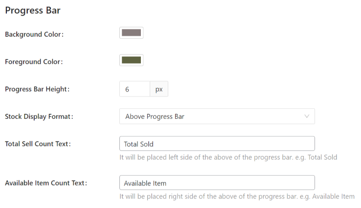
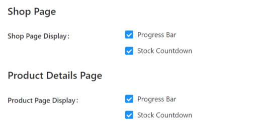
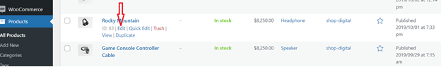
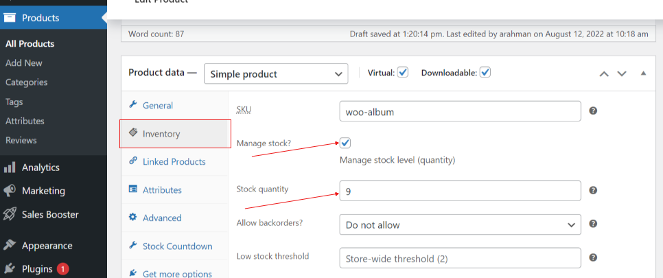
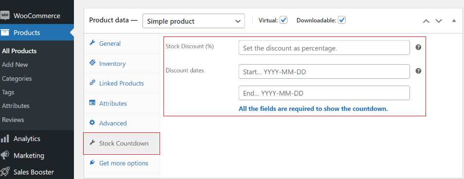
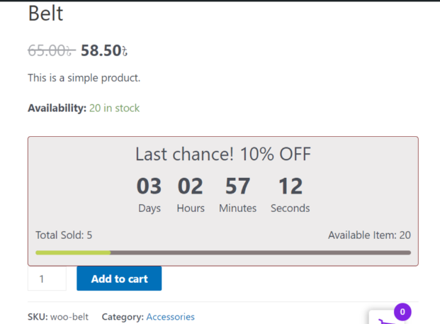

# Stock Countdown Module.
This is the second module of sales booster plugin. This will provide product stock countdown and discount offer to the selective products.

## How to active Stock Countdown?
Install sales booster plugin and activate stock countdown module. After activation, following Stock Countdown Settings will be shown.

- The countdown widget background and border color can be changed from the above options.

- The below figure demonestrate the progress bar related settings, i.e. background and foreground color, progress bar height and other settings easily can be updated according to your choice.

The countdown widget settings for Shop Page and Product Details Page can be changed as below.

After completing the settings, you have to edit product page in order to set "stock countdown" widget. For this purpose, click on products then edit of a single product as in below figure:

- Product Inventory Settings: In the product edit page, click on inventory option. Then you can see "Manage stock?" under the inventory tab as shown in below figure. Check mark the box to enable manage stock. Ensure that Simple product is selected under Product data. Then enter stock quanity in "Stock quantity" box.

- Stock Countdown Settings: Here, we can set discount rate in "Stock discount" box and discount dates, both the start and end dates are required to show the discount message.

- For the above changes, in front-end (shop page) you can see below like countdown widget. The background and border color, heading text, discount rate, stock quantity, etc. are changed according to the settings.

We are ready to here from you for any queries salesbooster@gmail.com for any further help.
